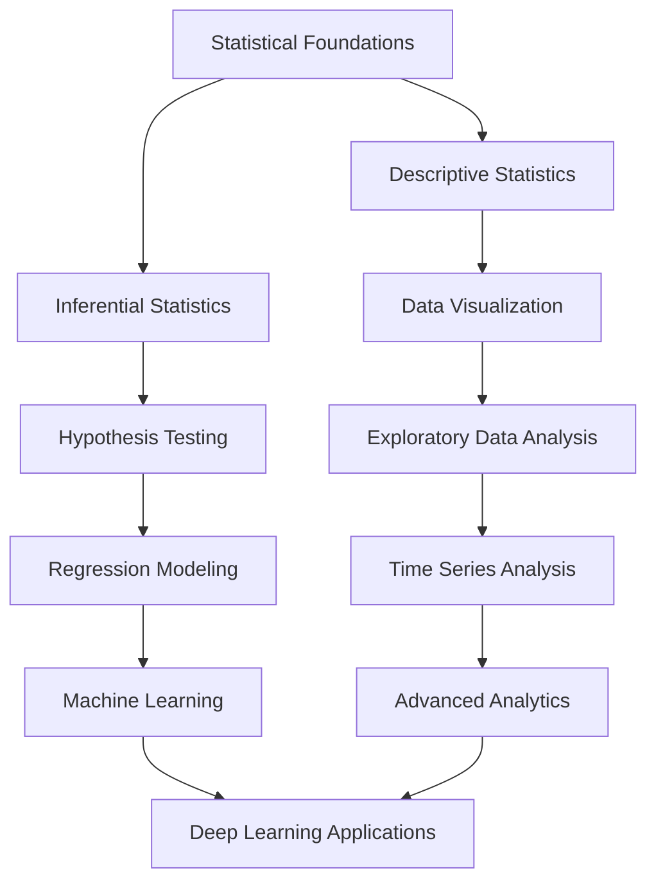

# Statistical Foundation of Data Science

[](https://www.python.org/downloads/)
[](https://jupyter.org/)
[](LICENSE)
[]()

## Student Information

| Field | Details |
|-------|---------|
| **Name** | Md Ayan Alam |
| **Roll Number** | GF202342645 |
| **Course** | Statistical Foundation of Data Science |
| **Institution** | Shoolini University of Biotechnology and Management Sciences |
| **Academic Year** | 2025 |

## Repository Overview

This repository contains comprehensive implementations and solutions for statistical analysis, data science methodologies, and computational mathematics assignments. Each assignment demonstrates practical applications of statistical concepts, data manipulation techniques, and advanced analytical methods using Python ecosystem.

## Repository Structure

```
Statistical-Foundation-of-Data-Science/
├── README.md                           # This file
├── requirements.txt                    # Python dependencies
├── .gitignore                         # Git ignore rules
├── LICENSE                            # Repository license
│
├── Practical Assignments/             # Hands-on coding assignments
│   ├── stats_analysis.ipynb          # Statistical Analysis & Array Operations
│   ├── generate_data.py               # Synthetic data generation
│   ├── synthetic_data.csv             # Generated dataset
│   ├── age_bin_statistics.csv         # Processed statistics
│   ├── Problems.txt                   # Assignment specifications
│   └── .venv/                         # Virtual environment
│
├── Project/                           # Major course projects
│   └── [Future project implementations]
│
├── Theory/                            # Theoretical foundations
│   ├── notes/                         # Course notes
│   ├── formulas/                      # Statistical formulas
│   └── references/                    # Academic references
│
├── Data/                              # Datasets and data sources
│   ├── raw/                           # Original datasets
│   ├── processed/                     # Cleaned datasets
│   └── external/                      # External data sources
│
├── Utils/                             # Utility functions
│   ├── statistical_functions.py      # Custom statistical methods
│   ├── visualization_helpers.py      # Plotting utilities
│   └── data_preprocessing.py         # Data cleaning functions
│
└── Reports/                           # Analysis reports
    ├── assignment_reports/            # Individual assignment reports
    └── project_reports/              # Comprehensive project reports
```

## Assignment Catalog

### Completed Assignments

#### Assignment 1: Statistical Analysis and Array Operations
- **File**: `Practical Assignments/stats_analysis.ipynb`
- **Status**: Completed
- **Completion Date**: September 16, 2025
- **Topics Covered**:
  - Statistical measures (mean, median, weighted mean)
  - Data standardization and outlier detection
  - Age-based demographic binning
  - NumPy array operations and linear algebra
- **Key Technologies**: Pandas, NumPy, Matplotlib, Seaborn, SciPy
- **Deliverables**:
  - Jupyter notebook with complete analysis
  - Generated synthetic dataset
  - Age bin statistics export
  - Comprehensive visualizations

**Technical Achievements**:
- Robust NaN handling without data loss
- Z-score standardization with outlier detection
- Tidy data principles implementation
- Advanced linear algebra operations
- Professional visualization standards

---

## Technical Requirements

### Core Dependencies
```python
# Data Science Stack
pandas >= 2.3.0
numpy >= 2.3.0
scipy >= 1.16.0
scikit-learn >= 1.7.0
statsmodels >= 0.14.0

# Visualization
matplotlib >= 3.10.0
seaborn >= 0.13.0
plotly >= 6.0.0

# Jupyter Environment
jupyter >= 1.1.0
ipykernel >= 6.30.0
jupyterlab >= 4.4.0

# Statistical Computing
sympy >= 1.14.0
numba >= 0.61.0

# Development Tools
black >= 25.0.0
flake8 >= 7.0.0
pytest >= 8.0.0
```

### Development Environment Setup

1. **Clone Repository**
   ```bash
   git clone https://github.com/ayanalamMOON/Statistical-Foundation-of-Data-Science.git
   cd Statistical-Foundation-of-Data-Science
   ```

2. **Create Virtual Environment**
   ```bash
   python -m venv .venv
   source .venv/Scripts/activate  # Windows
   # source .venv/bin/activate    # Linux/Mac
   ```

3. **Install Dependencies**
   ```bash
   pip install -r requirements.txt
   ```

4. **Launch Jupyter Lab**
   ```bash
   jupyter lab
   ```

## Progress Tracking

### Assignment Completion Matrix

| Assignment | Start Date | Due Date | Status | Grade | Notes |
|------------|------------|----------|---------|-------|-------|
| Statistical Analysis & Array Ops | Sep 13, 2025 | Sep 16, 2025 | Completed | - | Comprehensive implementation |

### Skills Development Roadmap



## Learning Objectives

### Core Competencies
- **Statistical Theory**: Master fundamental and advanced statistical concepts
- **Data Manipulation**: Proficient use of pandas and NumPy for data operations
- **Visualization**: Create publication-quality statistical visualizations
- **Hypothesis Testing**: Apply appropriate statistical tests for various scenarios
- **Modeling**: Develop and validate statistical and machine learning models
- **Programming**: Write clean, efficient, and well-documented Python code

### Advanced Skills
- **Bayesian Methods**: Implement Bayesian statistical approaches
- **Time Series**: Analyze and forecast time-dependent data
- **Multivariate Analysis**: Handle complex multi-dimensional datasets
- **Computational Statistics**: Use simulation and resampling methods
- **Statistical Software**: Proficiency in R, Python, and specialized packages

## Resources and References

### Textbooks
- "Introduction to Statistical Learning" by James, Witten, Hastie, Tibshirani
- "The Elements of Statistical Learning" by Hastie, Tibshirani, Friedman
- "Bayesian Data Analysis" by Gelman, Carlin, Stern, Rubin
- "Time Series Analysis and Its Applications" by Shumway, Stoffer

### Online Resources
- [Python Data Science Handbook](https://jakevdp.github.io/PythonDataScienceHandbook/)
- [Statistical Learning Course (Stanford)](https://www.statlearning.com/)
- [Scipy Stats Documentation](https://docs.scipy.org/doc/scipy/reference/stats.html)
- [Pandas Documentation](https://pandas.pydata.org/docs/)

### Academic Papers
- References will be added as assignments progress
- Citation format: APA Style

## License

This repository is licensed under the MIT License. See [LICENSE](LICENSE) file for details.

## Contributing

This is an academic repository for coursework. While external contributions are not expected, feedback and suggestions are welcome through issues.

## Contact

**Md Ayan Alam**
Roll Number: GF202342645
Email: [mdalam@shooliniuniversity.com]
GitHub: [@ayanalamMOON](https://github.com/ayanalamMOON)

---

*Last Updated: September 16, 2025*
*Repository maintained for academic purposes*
