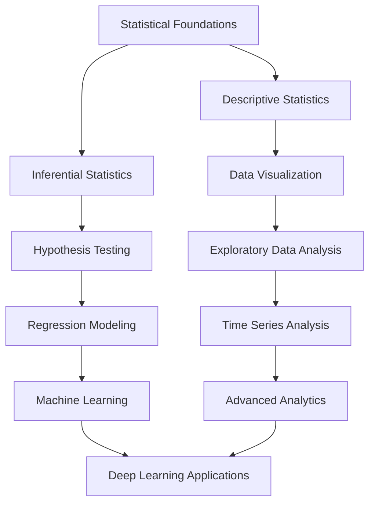

# Statistical Foundation of Data Science

[](https://www.python.org/downloads/)
[](https://jupyter.org/)
[](LICENSE)
[]()

## Student Information

| Field             | Details                                                      |
| ----------------- | ------------------------------------------------------------ |
| **Name**          | Md Ayan Alam                                                 |
| **Roll Number**   | GF202342645                                                  |
| **Course**        | Statistical Foundation of Data Science                       |
| **Institution**   | Shoolini University of Biotechnology and Management Sciences |
| **Academic Year** | 2025                                                         |

## Repository Overview

This repository contains comprehensive implementations and solutions for statistical analysis, data science methodologies, and computational mathematics assignments. Each assignment demonstrates practical applications of statistical concepts, data manipulation techniques, and advanced analytical methods using Python ecosystem.

## Repository Structure

```
Statistical-Foundation-of-Data-Science/
├── README.md                           # This file
├── requirements.txt                    # Python dependencies
├── requirements_enhanced.txt           # Enhanced dependencies with extras
├── pyproject.toml                      # Project configuration file
├── .gitignore                         # Git ignore rules
├── LICENSE                            # Repository license (MIT)
├── .venv/                             # Virtual environment (in root)
├── main.py                            # Main entry point
├── format_code.sh                     # Code formatting script
├── Assignment_6.pdf                   # Root-level Assignment 6 PDF
├── uv.lock                            # UV package manager lock file
│
├── .github/                           # GitHub configuration
│   └── copilot-instructions.md        # Copilot agent instructions
│
├── share/                             # Shared resources
│   └── jupyter/                       # Jupyter configurations
│       └── kernels/                   # Jupyter kernels
│
├── Practical Assignments/             # Hands-on coding assignments
│   ├── Assignment 1/                  # First assignment - Statistical Analysis
│   │   ├── stats_analysis.ipynb      # Statistical Analysis & Array Operations
│   │   ├── Assignment_1.ipynb         # Complete assignment notebook
│   │   ├── Assignment_1.pdf           # PDF export of assignment
│   │   ├── generate_data.py           # Synthetic data generation
│   │   ├── synthetic_data.csv         # Generated dataset
│   │   ├── age_bin_statistics.csv     # Processed statistics
│   │   └── Problems.txt               # Assignment specifications
│   │
│   ├── Assignment 2/                  # Second assignment - Teacher Rating Analysis
│   │   ├── Assignment_2.ipynb         # Complete analysis notebook
│   │   ├── Assignment_2.pdf           # PDF export of assignment
│   │   ├── Assignment2.txt            # Assignment specifications
│   │   ├── generate_rating_data.py    # Teacher rating data generator
│   │   └── teacher_ratings.csv        # Generated teacher dataset (500 records)
│   │
│   ├── Assignment 3/                  # Third assignment - Advanced Analysis
│   │   ├── Assignment_3.ipynb         # Complete analysis notebook
│   │   ├── Assignment_3.pdf           # PDF export of assignment
│   │   └── Assignment 3.txt           # Assignment specifications
│   │
│   ├── Assignment_4/                  # Fourth assignment - Categorical & Continuous Variables
│   │   ├── Assignment_4.ipynb         # Complete analysis notebook (emoji-free)
│   │   ├── Assignment_4.pdf           # PDF export of assignment
│   │   ├── Assignment_4.txt           # Assignment specifications
│   │   ├── Assignment_4_Presentation.pdf  # Beamer presentation
│   │   ├── Assignment_4_Presentation.tex  # LaTeX source for presentation
│   │   ├── PRESENTATION_README.md     # Presentation documentation
│   │   └── remaining_cells.txt        # Additional content
│   │
│   ├── Assignment_5/                  # Fifth assignment - Advanced Statistical Methods
│   │   ├── Assignment_5.ipynb         # Complete analysis notebook
│   │   ├── Assignment_5.pdf           # PDF export of assignment
│   │   ├── Assignment_5.txt           # Assignment specifications
│   │   └── Assignment_5_backup.ipynb  # Backup notebook
│   │
│   ├── Assignment 6/                  # Sixth assignment - Statistical Testing
│   │   ├── Assignment_6.ipynb         # Complete analysis notebook
│   │   ├── Assignment_6.pdf           # PDF export of assignment
│   │   ├── Assignment_6.tex           # LaTeX source file
│   │   └── Assignment_6.txt           # Assignment specifications
│   │
│   ├── Practical 7/                   # Regression Analysis
│   │   ├── Practical_7.ipynb          # Regression with T-test and ANOVA
│   │   ├── Practical_7.pdf            # PDF export
│   │   └── Practical_7.txt            # Assignment specifications
│   │
│   ├── Practical_8/                   # Decision Trees
│   │   ├── Practical_8.ipynb          # Decision tree implementation
│   │   ├── Practical_8.txt            # Assignment specifications
│   │   ├── README.md                  # Practical 8 documentation
│   │   └── notebook_builder.py        # Helper script
│   │
│   ├── Practical_9/                   # KNN Classification
│   │   ├── Practical_9.ipynb          # K-Nearest Neighbors on Iris dataset
│   │   └── Practical9.txt             # Assignment specifications
│   │
│   ├── Practical 10/                  # Principal Component Analysis
│   │   ├── Practical_10.ipynb         # PCA on wine dataset
│   │   └── Practical_10.txt           # Assignment specifications
│   │
│   ├── Practical 11/                  # Bayesian Statistics
│   │   ├── Practical_11.ipynb         # MCMC and Gamma distribution modeling
│   │   └── Practial11.txt             # Assignment specifications
│   │
│   └── Practical_12/                  # Advanced MCMC
│       ├── Practical_12.ipynb         # Metropolis Algorithm implementation
│       └── Practical12.txt            # Assignment specifications
│
├── Lecture Assignments/               # Lecture-based theoretical assignments
│   ├── Assignment 1/                  # First lecture assignment
│   │   ├── Statistical_FDS_Assignment_1_Solutions.ipynb
│   │   ├── Statistical_FDS_Assignment_1_Solutions.pdf
│   │   ├── Statistical_FDS_Assignment_1_Solutions.tex
│   │   ├── Statistical_FDS_Assignment_1_Solutions_files/  # Supporting images
│   │   ├── custom_pdf_converter.py    # PDF conversion utility
│   │   └── fix_unicode.py             # Unicode fixing utility
│   │
│   ├── Assignment_2/                  # Second lecture assignment (LaTeX)
│   │   ├── Assignment2.pdf            # Problem statement
│   │   ├── Assignment2.tex            # Problem source
│   │   ├── Assignment2_Solutions.pdf  # Complete solutions
│   │   ├── Assignment2_Solutions.tex  # Solutions source
│   │   ├── problem6_parts_bc.tex      # Partial solution file
│   │   └── Mini_Version/              # Condensed version
│   │       ├── Assignment2_Solutions_Mini.pdf
│   │       ├── Assignment2_Solutions_Mini.tex
│   │       └── Assinment2.pdf
│   │
│   └── Assignment_3/                  # Third lecture assignment (LaTeX)
│       ├── Assignment3.pdf            # Problem statement
│       ├── Assignment3.tex            # Problem source
│       ├── Assignment3_NEW.tex        # Updated version
│       ├── Assignment3_Solutions.pdf  # Complete solutions
│       ├── Assignment3_Solutions.tex  # Solutions source
│       └── Assignment3_backup.tex     # Backup copy
│
├── Practical_exam/                    # Practical examination
│   ├── Practical_Exam_2_Solution.ipynb # Exam solution notebook
│   ├── Practical_Exam_2_Solution.pdf   # PDF export
│   ├── Practical_exam.txt             # Exam specifications
│   ├── sol.txt                        # Solution notes
│   └── viva.md                        # Viva preparation materials
│
├── Practice Problems/                 # Additional practice materials
│   ├── Practice_Problems.pdf          # Compiled practice problems
│   ├── Practice_Problems.tex          # LaTeX source
│   └── Practice_Solutions/            # Solutions to practice problems
│       ├── Q14.pdf                    # Solution to Question 14
│       ├── Q14.tex                    # LaTeX source
│       └── Q14.txt                    # Problem description
│
├── LatexTypstCompiler/                # LaTeX/Typst compilation tool
│   ├── index.js                       # Main entry point
│   ├── server.js                      # Compilation server
│   ├── test.pdf                       # Test output
│   ├── test.typ                       # Test Typst file
│   ├── bin/                           # Binary executables
│   │   └── ltc.js                     # CLI tool
│   ├── src/                           # Source code
│   │   ├── compiler.js                # Compilation logic
│   │   ├── parser.js                  # Output parser
│   │   ├── scanner.js                 # File scanner
│   │   └── ui.js                      # User interface
│   └── client/                        # Web client
│       ├── README.md                  # Client documentation
│       ├── index.html                 # Main HTML
│       ├── vite.config.js             # Vite configuration
│       ├── eslint.config.js           # ESLint configuration
│       ├── public/                    # Public assets
│       └── src/                       # React source files
│           ├── App.jsx                # Main app component
│           ├── App.css                # Styles
│           ├── main.jsx               # Entry point
│           └── index.css              # Global styles
│
├── PDF_Merger/                        # PDF Merger GUI Application
│   ├── pdf_merger_gui.py              # Main GUI application
│   ├── README.md                      # Complete documentation
│   ├── requirements.txt               # Dependencies
│   ├── install.bat                    # Installation script
│   ├── install_and_run.bat            # One-click install & run
│   ├── run.bat                        # Run script
│   ├── check_dependencies.py          # Dependency checker
│   ├── COMPRESSION_GUIDE.md           # PDF compression guide
│   ├── COMPRESSION_IMPLEMENTATION.md  # Implementation details
│   ├── FIX_LOG.md                     # Bug fix log
│   ├── PROJECT_SUMMARY.md             # Project summary
│   ├── QUICK_REFERENCE.txt            # Quick reference
│   ├── QUICK_START.md                 # Quick start guide
│   ├── RELEASE_NOTES_V1.1.md          # Release notes
│   └── VISUAL_GUIDE.md                # Visual usage guide
│
├── Theory/                            # Theoretical foundations
│   ├── notes/                         # Course notes
│   │   ├── 00_study_guide.md
│   │   ├── 01_descriptive_statistics_notes.md
│   │   ├── 01_descriptive_statistics_interactive.ipynb
│   │   ├── 02_probability_distributions_notes.md
│   │   ├── 02_probability_distributions_interactive.ipynb
│   │   ├── 03_hypothesis_testing_notes.md
│   │   ├── 03_hypothesis_testing_interactive.ipynb
│   │   ├── 04_regression_analysis_notes.md
│   │   ├── 05_linear_algebra_notes.md
│   │   ├── 06_bayesian_statistics_notes.md
│   │   └── README.md
│   ├── formulas/                      # Statistical formulas
│   │   └── statistical_formulas_reference.ipynb
│   └── Markov Chain/                  # Markov Chain study materials
│       ├── markov_chain_study_material.pdf
│       ├── markov_chain_study_material.typ
│       └── markov_chain_study_material_backup.typ
│
├── Utils/                             # Utility functions
│   ├── statistical_functions.py      # Custom statistical methods
│   ├── visualization_helpers.py      # Plotting utilities
│   └── data_preprocessing.py         # Data cleaning functions
```

## Assignment Catalog

### Completed Practical Assignments

#### Assignment 1: Statistical Analysis and Array Operations
- **File**: `Practical Assignments/Assignment 1/stats_analysis.ipynb`
- **Status**: ✅ Completed
- **Completion Date**: September 16, 2025
- **Topics Covered**:
  - Statistical measures (mean, median, weighted mean)
  - Data standardization and outlier detection
  - Age-based demographic binning
  - NumPy array operations and linear algebra
- **Key Technologies**: Pandas, NumPy, Matplotlib, Seaborn, SciPy
- **Deliverables**:
  - Jupyter notebook with complete analysis
  - Generated synthetic dataset
  - Age bin statistics export
  - Comprehensive visualizations

**Technical Achievements**:
- Robust NaN handling without data loss
- Z-score standardization with outlier detection
- Tidy data principles implementation
- Advanced linear algebra operations
- Professional visualization standards

#### Assignment 2: Teacher Rating Data Analysis
- **File**: `Practical Assignments/Assignment 2/Assignment_2.ipynb`
- **Status**: ✅ Completed
- **Completion Date**: October 3, 2025
- **Topics Covered**:
  - Data type identification (Cross-sectional vs Time Series)
  - Comprehensive descriptive statistics computation
  - Distribution analysis and normality testing
  - Gender-based comparative analysis
  - Chi-square test of independence
  - Effect size calculations (Cohen's d, Cramér's V)
- **Key Technologies**: Pandas, NumPy, Matplotlib, Seaborn, SciPy
- **Deliverables**:
  - Jupyter notebook with 6 complete questions
  - PDF export for submission
  - Synthetic teacher rating dataset (500 teachers, 12 variables)
  - Multiple statistical visualizations (histograms, box plots, Q-Q plots, violin plots)

**Technical Achievements**:
- Generated realistic synthetic dataset with correlations
- Performed statistical hypothesis testing (t-tests, chi-square)
- Created publication-quality multi-panel visualizations
- Implemented normality tests (Shapiro-Wilk, D'Agostino)
- Calculated effect sizes for practical significance
- Cross-tabulation and contingency table analysis
- Professional markdown documentation with interpretations

#### Assignment 3: Advanced Teacher Rating Analysis
- **File**: `Practical Assignments/Assignment 3/Assignment_3.ipynb`
- **Status**: ✅ Completed
- **Completion Date**: October 9, 2025
- **Topics Covered**:
  - Duplicate identification and handling
  - Filtered data analysis and comparison
  - Course division comparative analysis
  - Bivariate relationship exploration (scatter plots)
  - Multi-variable analysis with differentiation
  - Advanced data filtering and segmentation
- **Key Technologies**: Pandas, NumPy, Matplotlib, Seaborn, SciPy
- **Deliverables**:
  - Jupyter notebook with 5 complete questions
  - PDF export for submission
  - Comparative visualizations (bar charts, scatter plots)
  - Statistical analysis across multiple variables

**Technical Achievements**:
- Advanced data filtering and duplicate detection
- Multi-level data segmentation and comparison
- Complex scatter plot analysis with multiple groupings
- Course division analysis with statistical significance testing
- Professional multi-panel visualization layouts
- Comprehensive statistical reporting

#### Assignment 4: Categorical and Continuous Variable Analysis
- **File**: `Practical Assignments/Assignment_4/Assignment_4.ipynb`
- **Status**: ✅ Completed
- **Completion Date**: October 13, 2025
- **Topics Covered**:
  - Chi-square test of independence for categorical variables
  - Independent samples t-test for group comparisons
  - Visualization selection and implementation
  - Horizontal vs vertical bar chart analysis
  - Median analysis and non-parametric testing
  - Mann-Whitney U test
  - Effect size calculations (Cohen's d, Cramér's V, Rank-biserial)
- **Key Technologies**: Pandas, NumPy, Matplotlib, Seaborn, SciPy, Statsmodels
- **Deliverables**:
  - Jupyter notebook with 5 complete questions (emoji-free, professional format)
  - PDF export for submission
  - Beamer presentation (LaTeX)
  - Comprehensive visualizations (histograms, KDE, box plots, violin plots, CDFs)
  - Multiple statistical test implementations

**Technical Achievements**:
- Chi-square test with contingency tables and expected frequencies
- Assumption checking for parametric tests (normality, homogeneity of variance)
- Non-parametric alternatives (Mann-Whitney U test)
- Multiple effect size measures with interpretation
- Advanced visualization techniques (KDE, Q-Q plots, cumulative distributions)
- Data cleaning and NaN handling for robust analysis
- Professional, academic-style presentation (emoji-free)
- Risk ratios and odds ratios calculation
- Multi-panel figure layouts with GridSpec
- Comprehensive statistical reporting with formal notation

#### Assignment 5: Advanced Statistical Methods
- **File**: `Practical Assignments/Assignment_5/Assignment_5.ipynb`
- **Status**: ✅ Completed
- **Completion Date**: October 2025
- **Topics Covered**:
  - Advanced statistical testing methodologies
  - Complex data analysis techniques
  - Multi-variable statistical relationships
- **Key Technologies**: Pandas, NumPy, Matplotlib, Seaborn, SciPy, Statsmodels
- **Deliverables**:
  - Jupyter notebook with complete analysis
  - PDF export for submission
  - Backup notebook for version control

#### Assignment 6: Statistical Testing (T-Test, ANOVA, Chi-Square, Correlation)
- **File**: `Practical Assignments/Assignment 6/Assignment_6.ipynb`
- **Status**: ✅ Completed
- **Completion Date**: October 2025
- **Topics Covered**:
  - T-Test: Gender effect on teaching evaluation rates
  - ANOVA: Beauty score differences by age
  - Chi-square: Association between tenure and gender
  - Correlation: Relationship between evaluation score and beauty score
- **Key Technologies**: Pandas, NumPy, Matplotlib, Seaborn, SciPy, Statsmodels
- **Deliverables**:
  - Jupyter notebook with 4 complete questions
  - PDF export for submission
  - LaTeX source file for academic formatting

**Technical Achievements**:
- Comprehensive hypothesis testing suite
- ANOVA for multi-group comparisons
- Chi-square test for categorical associations
- Correlation analysis with significance testing
- Professional LaTeX documentation

#### Practical 7: Regression Analysis with Statistical Tests
- **File**: `Practical Assignments/Practical 7/Practical_7.ipynb`
- **Status**: ✅ Completed
- **Completion Date**: November 2025
- **Topics Covered**:
  - Regression with T-test for gender effects
  - Regression with ANOVA for age group differences
  - OLS (Ordinary Least Squares) regression modeling
  - Model diagnostics and interpretation
- **Key Technologies**: Pandas, NumPy, Matplotlib, Seaborn, Statsmodels
- **Deliverables**:
  - Jupyter notebook with regression analysis
  - PDF export for submission
  - Complete OLS regression results with interpretation

**Technical Achievements**:
- OLS regression implementation
- Statistical significance testing within regression framework
- Model fit assessment (R-squared, F-statistic)
- Residual analysis and diagnostics
- Professional statistical reporting

#### Practical 8: Decision Trees
- **File**: `Practical Assignments/Practical_8/Practical_8.ipynb`
- **Status**: ✅ Completed
- **Completion Date**: November 2025
- **Topics Covered**:
  - Decision tree classification
  - Tree visualization and interpretation
  - Feature importance analysis
  - Model evaluation metrics
- **Key Technologies**: Pandas, NumPy, Matplotlib, Seaborn, Scikit-learn, Graphviz
- **Deliverables**:
  - Jupyter notebook with decision tree implementation
  - README documentation with setup instructions
  - Helper notebook builder script

**Technical Achievements**:
- Decision tree classifier implementation
- Tree visualization with graphviz
- Feature importance ranking
- Classification metrics and confusion matrix
- Comprehensive documentation

#### Practical 9: K-Nearest Neighbors (KNN) Classification
- **File**: `Practical Assignments/Practical_9/Practical_9.ipynb`
- **Status**: ✅ Completed
- **Completion Date**: November 2025
- **Topics Covered**:
  - Exploratory Data Analysis (EDA) on Iris dataset
  - Feature scaling and normalization
  - K-NN model training
  - Confusion matrix and accuracy metrics
  - Classification report
  - Error rate vs K value analysis
- **Key Technologies**: Pandas, NumPy, Matplotlib, Seaborn, Scikit-learn
- **Deliverables**:
  - Jupyter notebook with complete KNN implementation
  - EDA visualizations
  - Model performance analysis

**Technical Achievements**:
- Complete EDA workflow (head, describe, groupby)
- Feature scaling implementation
- K-NN classifier with hyperparameter tuning
- Comprehensive model evaluation
- Error rate optimization

#### Practical 10: Principal Component Analysis (PCA)
- **File**: `Practical Assignments/Practical 10/Practical_10.ipynb`
- **Status**: ✅ Completed
- **Completion Date**: November 2025
- **Topics Covered**:
  - Descriptive statistics on wine dataset
  - Box plot analysis by output classes
  - Scatter plot visualization
  - Covariance matrix computation
  - Data scaling techniques
  - PCA for dimensionality reduction
  - Class separation visualization
- **Key Technologies**: Pandas, NumPy, Matplotlib, Seaborn, Scikit-learn
- **Deliverables**:
  - Jupyter notebook with complete PCA implementation
  - Covariance matrix visualization
  - Principal component analysis results

**Technical Achievements**:
- Comprehensive wine dataset analysis
- Covariance matrix computation and visualization
- PCA implementation for dimensionality reduction
- Improved class separation demonstration
- Multi-panel visualization layouts

#### Practical 11: Bayesian Statistics and MCMC
- **File**: `Practical Assignments/Practical 11/Practical_11.ipynb`
- **Status**: ✅ Completed
- **Completion Date**: November 2025
- **Topics Covered**:
  - Sunspot data analysis (1749-2018)
  - Gamma distribution modeling
  - Markov Chain Monte Carlo (MCMC) simulation
  - Trace visualization and burn-in analysis
  - Parameter estimation (alpha and beta)
  - Posterior distribution analysis
- **Key Technologies**: Pandas, NumPy, Matplotlib, Seaborn, SciPy
- **Deliverables**:
  - Jupyter notebook with Bayesian analysis
  - Time series visualizations
  - MCMC trace plots and histograms

**Technical Achievements**:
- Historical sunspot data analysis
- Gamma distribution fitting
- MCMC implementation with burn-in
- Trace visualization for convergence diagnostics
- Parameter prediction and posterior analysis

#### Practical 12: Metropolis Algorithm and Deterministic Models
- **File**: `Practical Assignments/Practical_12/Practical_12.ipynb`
- **Status**: ✅ Completed
- **Completion Date**: November 2025
- **Topics Covered**:
  - Part A: Metropolis Algorithm implementation
  - Part B: Deterministic modeling
  - MCMC sampling techniques
  - Model comparison and validation
- **Key Technologies**: Pandas, NumPy, Matplotlib, Seaborn, SciPy
- **Deliverables**:
  - Jupyter notebook with algorithm implementations
  - Comparative analysis results

**Technical Achievements**:
- Custom Metropolis algorithm implementation
- Deterministic model development
- MCMC sampling and analysis
- Model comparison framework

---

### Completed Lecture Assignments

#### Lecture Assignment 1: Statistical Foundations
- **Files**: `Lecture Assignments/Assignment 1/`
- **Status**: ✅ Completed
- **Completion Date**: October 2025
- **Format**: LaTeX + Jupyter Notebook hybrid
- **Topics Covered**:
  - Fundamental statistical concepts
  - Theoretical problem solving
  - Mathematical derivations
- **Deliverables**:
  - Solutions notebook (.ipynb)
  - LaTeX source file (.tex)
  - PDF export with visualizations
  - Supporting image files

**Technical Achievements**:
- LaTeX mathematical typesetting
- Jupyter-to-LaTeX conversion
- Custom PDF conversion utilities
- Unicode handling for special characters

#### Lecture Assignment 2: Probability Distributions and Random Variables
- **Files**: `Lecture Assignments/Assignment_2/`
- **Status**: ✅ Completed
- **Completion Date**: November 2025
- **Format**: Pure LaTeX
- **Topics Covered**:
  - Zero-inflated normal distribution (PMF/PDF, CDF, moments)
  - Binomial distribution with normal approximation
  - Poisson thinning property
  - Conditional distributions
  - Maximum likelihood estimation
  - Delta method for variance
  - Bayesian inference with Beta priors
- **Deliverables**:
  - Complete solutions PDF (Assignment2_Solutions.pdf)
  - LaTeX source files
  - Mini version for quick reference
  - Partial solution files

**Technical Achievements**:
- Advanced probability theory derivations
- Mathematical rigor in proofs
- Professional LaTeX formatting
- Multi-part problem decomposition
- Bayesian and frequentist approaches

#### Lecture Assignment 3: K-Nearest Neighbors and Clustering
- **Files**: `Lecture Assignments/Assignment_3/`
- **Status**: ✅ Completed
- **Completion Date**: December 2025 (Deadline: Dec 20, 2025)
- **Format**: Pure LaTeX
- **Topics Covered**:
  - KNN classification with feature normalization
  - Medical diagnosis problem (glucose and BMI)
  - Decision boundary derivation
  - K-Means clustering algorithm
  - Within-cluster variance optimization
  - Cluster quality metrics
  - Hierarchical clustering
- **Deliverables**:
  - Complete solutions PDF (Assignment3_Solutions.pdf)
  - LaTeX source files
  - Multiple backup versions

**Technical Achievements**:
- Euclidean distance computations
- Feature normalization mathematics
- Algebraic decision boundary derivation
- K-Means algorithm step-by-step execution
- Cluster centroid calculations
- Complete linkage clustering

---

### Practical Examination

#### Practical Exam 2: Comprehensive Statistical Analysis
- **File**: `Practical_exam/Practical_Exam_2_Solution.ipynb`
- **Status**: ✅ Completed
- **Format**: Jupyter Notebook
- **Topics Covered**:
  - Comprehensive data analysis
  - Statistical testing under exam conditions
  - Applied problem solving
- **Deliverables**:
  - Solution notebook with complete analysis
  - PDF export for submission
  - Viva preparation materials (viva.md)
  - Solution notes

**Technical Achievements**:
- Time-constrained analysis
- Complete statistical workflow
- Professional presentation under pressure

---

### Practice Problems

#### Practice Problem Solutions
- **Location**: `Practice Problems/`
- **Status**: ✅ In Progress
- **Format**: LaTeX
- **Content**:
  - Comprehensive problem set (Practice_Problems.pdf)
  - Detailed solutions for selected problems
  - Question 14 complete solution with LaTeX source
- **Deliverables**:
  - Problem compilation (LaTeX)
  - Individual solution files

**Technical Achievements**:
- Extensive problem coverage
- LaTeX mathematical typesetting
- Structured solution format

---

## Technical Requirements

### Core Dependencies
```python
# Data Science Stack
pandas >= 2.3.0
numpy >= 2.3.0
scipy >= 1.16.0
scikit-learn >= 1.7.0
statsmodels >= 0.14.0

# Visualization
matplotlib >= 3.10.0
seaborn >= 0.13.0
plotly >= 6.0.0

# Jupyter Environment
jupyter >= 1.1.0
ipykernel >= 6.30.0
jupyterlab >= 4.4.0

# Statistical Computing
sympy >= 1.14.0
numba >= 0.61.0

# Development Tools
black >= 25.0.0
flake8 >= 7.0.0
pytest >= 8.0.0
```

### Development Environment Setup

1. **Clone Repository**
   ```bash
   git clone https://github.com/ayanalamMOON/Statistical-Foundation-of-Data-Science.git
   cd Statistical-Foundation-of-Data-Science
   ```

2. **Create Virtual Environment**
   ```bash
   python -m venv .venv
   source .venv/Scripts/activate  # Windows
   # source .venv/bin/activate    # Linux/Mac
   ```

3. **Install Dependencies**
   ```bash
   pip install -r requirements.txt
   ```

4. **Launch Jupyter Lab**
   ```bash
   jupyter lab
   ```

## Progress Tracking

### Assignment Completion Matrix

#### Practical Assignments

| Assignment                                       | Start Date   | Due Date       | Status        | Grade | Notes                                          |
| ------------------------------------------------ | ------------ | -------------- | ------------- | ----- | ---------------------------------------------- |
| Assignment 1: Statistical Analysis & Array Ops   | Sep 13, 2025 | Sep 16, 2025   | ✅ Completed  | -     | Comprehensive implementation                   |
| Assignment 2: Teacher Rating Data Analysis       | Sep 23, 2025 | Oct 10, 2025   | ✅ Completed  | -     | 6 questions with full statistical analysis     |
| Assignment 3: Advanced Teacher Rating Analysis   | Sep 29, 2025 | Oct 10, 2025   | ✅ Completed  | -     | 5 questions with advanced filtering            |
| Assignment 4: Categorical & Continuous Analysis  | Oct 6, 2025  | Oct 14, 2025   | ✅ Completed  | -     | 5 questions with hypothesis testing            |
| Assignment 5: Advanced Statistical Methods       | Oct 2025     | Oct 2025       | ✅ Completed  | -     | Advanced methodologies                         |
| Assignment 6: Statistical Testing                | Oct 14, 2025 | Oct 24, 2025   | ✅ Completed  | -     | T-Test, ANOVA, Chi-square, Correlation         |
| Practical 7: Regression Analysis                 | Nov 2025     | Nov 2025       | ✅ Completed  | -     | OLS regression with statistical tests          |
| Practical 8: Decision Trees                      | Nov 2025     | Nov 2025       | ✅ Completed  | -     | Classification with tree visualization         |
| Practical 9: KNN Classification                  | Nov 12, 2025 | Nov 18, 2025   | ✅ Completed  | -     | K-Nearest Neighbors on Iris dataset            |
| Practical 10: Principal Component Analysis       | Nov 18, 2025 | Nov 24, 2025   | ✅ Completed  | -     | PCA on wine dataset                            |
| Practical 11: Bayesian Statistics & MCMC         | Nov 18, 2025 | Nov 25, 2025   | ✅ Completed  | -     | Sunspot analysis with Gamma distribution       |
| Practical 12: Metropolis Algorithm               | Nov 25, 2025 | Nov 30, 2025   | ✅ Completed  | -     | MCMC and deterministic models                  |

#### Lecture Assignments

| Assignment                                       | Start Date   | Due Date       | Status        | Grade | Notes                                          |
| ------------------------------------------------ | ------------ | -------------- | ------------- | ----- | ---------------------------------------------- |
| Lecture Assignment 1: Statistical Foundations    | Sep 2025     | Oct 2025       | ✅ Completed  | -     | LaTeX/Jupyter hybrid format                    |
| Lecture Assignment 2: Probability & Distributions| Oct 2025     | Nov 14, 2025   | ✅ Completed  | -     | 7 problems, pure LaTeX                         |
| Lecture Assignment 3: KNN & Clustering           | Nov 2025     | Dec 20, 2025   | ✅ Completed  | -     | 7 problems on ML fundamentals                  |

#### Examinations & Practice

| Item                                             | Date         | Status        | Notes                                          |
| ------------------------------------------------ | ------------ | ------------- | ---------------------------------------------- |
| Practical Exam 2                                 | Nov 2025     | ✅ Completed  | Complete solution with viva preparation        |
| Practice Problems (Q14)                          | Ongoing      | 🔄 In Progress| Selected problem solutions                     |

### Skills Development Roadmap


```mermaid
graph TD
    A[Statistical Foundations] --> B[Descriptive Statistics]
    A --> C[Inferential Statistics]
    B --> D[Data Visualization]
    C --> E[Hypothesis Testing]
    D --> F[Exploratory Data Analysis]
    E --> G[Regression Modeling]
    F --> H[Time Series Analysis]
    G --> I[Machine Learning]
    H --> J[Advanced Analytics]
    I --> K[Deep Learning Applications]
    J --> K
```

## Learning Objectives

### Core Competencies
- **Statistical Theory**: Master fundamental and advanced statistical concepts
- **Data Manipulation**: Proficient use of pandas and NumPy for data operations
- **Visualization**: Create publication-quality statistical visualizations
- **Hypothesis Testing**: Apply appropriate statistical tests for various scenarios
- **Modeling**: Develop and validate statistical and machine learning models
- **Programming**: Write clean, efficient, and well-documented Python code

### Advanced Skills
- **Bayesian Methods**: Implement Bayesian statistical approaches
- **Time Series**: Analyze and forecast time-dependent data
- **Multivariate Analysis**: Handle complex multi-dimensional datasets
- **Computational Statistics**: Use simulation and resampling methods
- **Statistical Software**: Proficiency in R, Python, and specialized packages

## Code Quality Standards

### Formatting
This repository uses **Black** code formatter for consistent Python code style:
```bash
# Format Python files
black "path/to/file.py"

# Format Jupyter notebooks
black "path/to/notebook.ipynb"

# Check formatting without changes
black --check "path/to/file.py"
```

### Best Practices
- All code follows PEP 8 style guidelines
- Comprehensive docstrings for functions and classes
- Type hints for function parameters and returns
- Unit tests for utility functions
- Git commits follow conventional commit format

---

## Tools and Utilities

### PDF Merger GUI Application
- **Location**: `PDF_Merger/`
- **Purpose**: Standalone Windows GUI application for merging multiple PDF files
- **Features**:
  - Drag-and-drop interface
  - PDF compression options
  - Batch processing
  - File reordering
  - One-click installation
- **Technology**: Python, Tkinter, PyPDF2
- **Documentation**: Comprehensive guides in PDF_Merger folder
  - Quick start guide
  - Compression implementation details
  - Visual usage guide
  - Release notes

### LaTeX/Typst Compiler
- **Location**: `LatexTypstCompiler/`
- **Purpose**: Automated compilation system for LaTeX and Typst documents
- **Features**:
  - Command-line interface
  - Web-based interface (React client)
  - File watching and auto-compilation
  - Error parsing and reporting
  - Workspace scanning
- **Technology**: Node.js, React, Vite, Commander.js, Chokidar
- **Use Case**: Streamline compilation of lecture assignments and reports

---

## Theory and Study Materials

### Markov Chain Study Materials
- **Location**: `Theory/Markov Chain/`
- **Content**:
  - Comprehensive study material (PDF)
  - Typst source files
  - Backup versions
- **Topics Covered**:
  - Markov chain fundamentals
  - State transitions
  - Steady-state analysis
  - Applications in statistical modeling

### Interactive Theory Notebooks
- **Location**: `Theory/notes/` and `Theory/formulas/`
- **Content**:
  - Study guides and roadmaps
  - Descriptive statistics with interactive examples
  - Probability distributions exploration
  - Hypothesis testing decision trees
  - Regression analysis concepts
  - Linear algebra fundamentals
  - Bayesian statistics introduction
  - Statistical formulas reference

---

## Resources and References

### Textbooks
- "Introduction to Statistical Learning" by James, Witten, Hastie, Tibshirani
- "The Elements of Statistical Learning" by Hastie, Tibshirani, Friedman
- "Bayesian Data Analysis" by Gelman, Carlin, Stern, Rubin
- "Time Series Analysis and Its Applications" by Shumway, Stoffer

### Online Resources
- [Python Data Science Handbook](https://jakevdp.github.io/PythonDataScienceHandbook/)
- [Statistical Learning Course (Stanford)](https://www.statlearning.com/)
- [Scipy Stats Documentation](https://docs.scipy.org/doc/scipy/reference/stats.html)
- [Pandas Documentation](https://pandas.pydata.org/docs/)

### Academic Papers
- References will be added as assignments progress
- Citation format: APA Style

## License

This repository is licensed under the MIT License. See [LICENSE](LICENSE) file for details.

## Contributing

This is an academic repository for coursework. While external contributions are not expected, feedback and suggestions are welcome through issues.

## Contact

**Md Ayan Alam**
Roll Number: GF202342645
Email: [mdalam@shooliniuniversity.com]
GitHub: [@ayanalamMOON](https://github.com/ayanalamMOON)

---

## Recent Updates

### December 10, 2025
- **Major README Update**: Comprehensive documentation overhaul
  - Added Assignments 5 and 6 to catalog
  - Documented Practicals 7-12 (Regression, Decision Trees, KNN, PCA, Bayesian/MCMC)
  - Added Lecture Assignments 2 & 3 (Probability Distributions, KNN/Clustering)
  - Documented Practical Exam 2 solutions
  - Added Practice Problems section
  - Documented new tools: PDF Merger GUI and LaTeX/Typst Compiler
  - Added Markov Chain study materials section
  - Updated project configuration files (pyproject.toml, requirements_enhanced.txt)
  - Updated progress tracking matrix with all completed work
  - Comprehensive repository structure update

### November 2025
- Completed Practical 12: Metropolis Algorithm and Deterministic Models
- Completed Practical 11: Bayesian Statistics with MCMC on Sunspot Data
- Completed Practical 10: Principal Component Analysis on Wine Dataset
- Completed Practical 9: K-Nearest Neighbors Classification on Iris Dataset
- Completed Lecture Assignment 3: KNN and Clustering (LaTeX)
- Added Markov Chain study materials (Typst/PDF)
- Developed LaTeX/Typst Compiler tool with CLI and web interface
- Completed Practical Exam 2 with comprehensive solutions
- Created viva preparation materials

### October 2025
- Completed Lecture Assignment 2: Probability Distributions (7 problems, pure LaTeX)
  - Zero-inflated normal distribution analysis
  - Binomial approximation and Poisson thinning
  - Maximum likelihood estimation
  - Bayesian inference with Beta priors
- Completed Assignment 6: Statistical Testing (T-Test, ANOVA, Chi-Square, Correlation)
- Completed Assignment 5: Advanced Statistical Methods
- Completed Practical 8: Decision Trees with comprehensive documentation
- Completed Practical 7: Regression Analysis with OLS
- Enhanced PDF Merger application with compression features
- Created Assignment 4 Beamer presentation (LaTeX)

### October 13, 2025
- Completed Assignment 4: Categorical and Continuous Variable Analysis
- Implemented comprehensive hypothesis testing (chi-square, t-tests, Mann-Whitney U)
- Added effect size calculations (Cohen's d, Cramér's V, Rank-biserial correlation)
- Created advanced visualizations (KDE, violin plots, CDFs, Q-Q plots)
- Removed all emojis from Assignment 4 for professional presentation
- Generated professional PDF export (1.4 MB, emoji-free)
- Added data cleaning and NaN handling for robust analysis
- Implemented multi-panel figure layouts with GridSpec

### October 9, 2025
- Completed Assignment 3: Advanced Teacher Rating Analysis
- Added duplicate identification and filtering techniques
- Implemented course division comparative analysis
- Created bivariate relationship visualizations with scatter plots
- Generated PDF export for Assignment 3
- Enhanced data segmentation and filtering methods

### October 3, 2025
- Completed Assignment 2: Teacher Rating Data Analysis
- Added comprehensive statistical hypothesis testing
- Generated PDF exports for both assignments
- Implemented code formatting with Black
- Enhanced repository with description and 19 topics for discoverability
- Updated README with complete repository structure

### September 16, 2025
- Completed Assignment 1: Statistical Analysis and Array Operations
- Set up initial repository structure
- Created comprehensive theory notes and interactive notebooks
- Established development environment with virtual environment

---

*Last Updated: December 10, 2025*
*Repository maintained for academic purposes*
